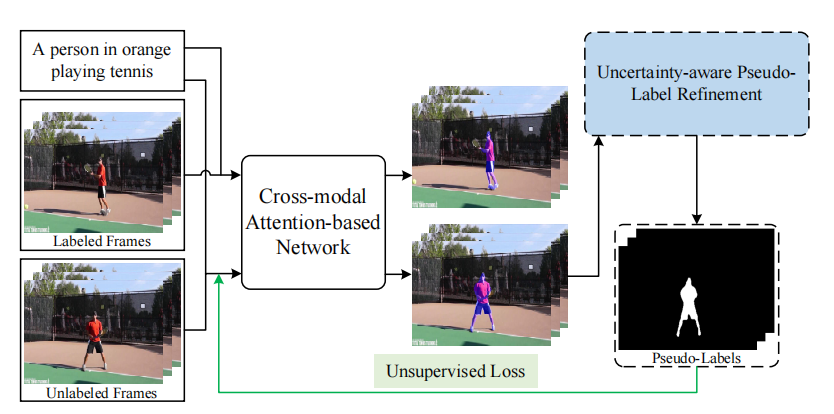

# PRVOS

This repo contains the official implementation of the paper:
<div align="center">
<h1>
<b>
Uncertainty-aware Adaptive Pseudo-Labeling for Referring Video Object Segmentation
</b>
</h1>
<h4>
<b>
Jinpeng Mi, Zhiqian Chen, Kunpeng Yuan, Jianwei Zhang
</b>
</h4>
</div>
<div align="center">
  
</div>

## News & Update Logs:
...Coming soon...
## Abstract
Referring video object segmentation (RVOS) is an emerging multimodal task aiming to segment target regions in video clips by understanding the semantics of given referring expressions. While the annotations of the benchmark datasets are collected in a semi-supervised manner, which only provides the ground truth object masks on the first frame of videos. To explore the concealed knowledge in the unlabeled data in a more integrated framework, we introduce online pseudo-labeling to address RVOS. Specifically, we employ the on-the-fly learned checkpoints in the previous training epochs as the teacher model to produce the pseudo-labels on the unlabeled video frames, and the obtained pseudo labels are utilized as augmentation for the training data to supervise the subsequent training stage. To avert the confusion derived from pseudo labels, we propose a uncertainty-aware refinement strategy to adaptively rectify the generated pseudo-labels based on the model prediction confidence. We conduct extensive experiments on the benchmark datasets Ref-YoutuBe-Vos and Refer-DAVIS17 to validate the proposed approach. The experimental results demonstrate that our model achieves competitive results compared with state-of-the-art models.
## Prerequisites
- Python 3.7
- Pytorch 1.10
- torchvision 0.11.2
- CUDA 11.4
- numpy 1.19.2
## Dataset Requirements
### Refer-Youtube-VOS
1. Download the dataset from the competition's website in [Codalab](https://competitions.codalab.org/competitions/29139#participate-get_data).
2. We can get two .json file meta_expression.json and meta.json
3. Run this code to integrate them into a new .json file: `python tools/data/merge_meta_json.py`
   The ready-made .json are stored in `Annotations/refer-youtube-vos/new_train.json`
   The structure of the new json file is as follow:
```text
videos
    ├── 003234408d
    │   └── objects
    │       ├── 1
    │       │   ├── category : 'penguin'
    │       │   ├── frames : {"00000", "00005"...}
    │       │   └── expressions : {"a penguin is on the left in the front with many others on the hill", ...}
    │       ├── 2
    │       │   ├── category : 'penguin'
    │       │   ├── frames : {"00000", "00005"...}
    │       │   └── expressions : {"a penguin is on the left in the front with many others on the hill", ...}
    │       ├──...
    ├── ...
```
4. The dataset of Refer-youtube-vos is recommended to be organized as following:
```text
refer_youtube_vos/ 
    ├── train/
    │   ├── JPEGImages/
    │   │   └── */ (video folders)
    │   │       └── *.jpg (frame image files) 
    │   ├── Annotations/
    │   │   └── */ (video folders)
    │   │       └── *.png (mask annotation files) 
    │   │
    │   └── new_train.json (text annotations)
    │
    └── valid/
        ├── JPEGImages/
        │    └── */ (video folders)
        │        └── *.jpg (frame image files)
        ├── Annotations/
        │   └── */ (video folders)
        │       └── *.png (mask annotation files)
        │
        └── new_valid.json (text annotations)
```

### Ref-DAVIS-2017
1. Download
